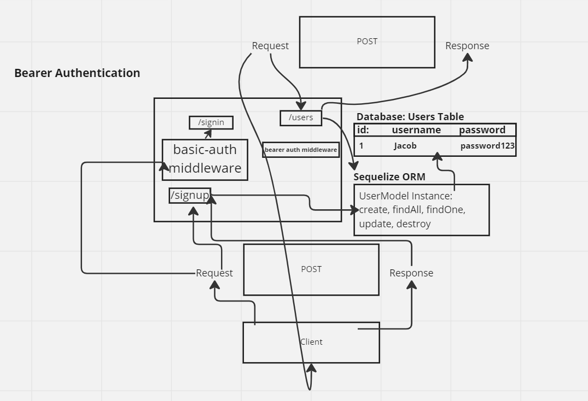

# LAB - Class 07

## Project: Bearer Authentication

### Author: Jacob Dang

### Problem Domain
Copy given starter code to repo. Run tests according to test file names and debug. 

### Links & Resources
{GitHub Actions} {URL}
{Deployed Database} {}

see '.env.sample'

### Features/Routes:
- ROUTES: POST /signup
- ROUTES: POST /signin
- ROUTES: GET /users
- ROUTES: GET /secret

#### Tests
- How do you run tests?
    - npm i

- Any tests of note:
    - npm test

## UML
